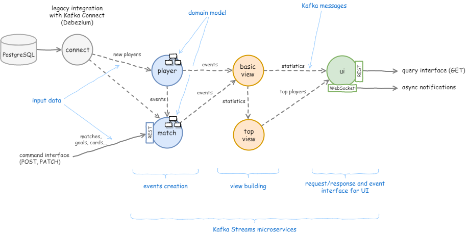
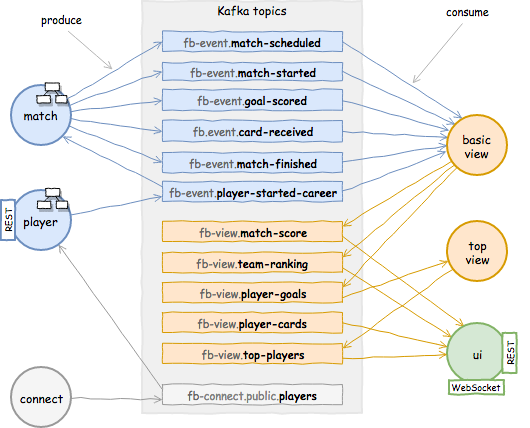

# Event-Driven microservices with Kafka Streams
Event-Driven microservices codebase applying the idea of [stateful streams processing] with [Kafka](https://kafka.apache.org/) and [Kafka Streams](https://kafka.apache.org/documentation/streams/). These Confluent's blog posts are a great introduction to that concept:
- [The Data Dichotomy: Rethinking the Way We Treat Data and Services](https://www.confluent.io/blog/data-dichotomy-rethinking-the-way-we-treat-data-and-services/)
- [Build Services on a Backbone of Events](https://www.confluent.io/blog/build-services-backbone-events/)
- [Using Apache Kafka as a Scalable, Event-Driven Backbone for Service Architectures](https://www.confluent.io/blog/apache-kafka-for-service-architectures/)

You can think of this project as a more comprehensive supplement to the basic code examples of Kafka Streams. Kafka Streams (and Kafka, of course) is used here for many purposes like aggregation, building materialized views, persisting the domain model or just exposing the output of services. Furthermore, there is no traditional database here, local state stores instead (PostgreSQL plays a role of legacy system only).

So what is this application doing? It generates a simple football statistics: scores, team rankings and player statistics (number of goals scored, yellow and red cards). It should be a little more comprehensible than a typical code examples based on orders, payments etc. 


Microservices
-------------



- __football-match__ - transforms REST requests into [Events](football-common/src/main/java/org/djar/football/model/event)
- __connect__ - Kafka Connect service with [Debezium PostgreSQL connector](http://debezium.io/docs/connectors/postgresql/); monitors changes in the database
- __football-player__ - receives notifications from __connect__ service and creates only a single Event [PlayerStartedCareer](football-common/src/main/java/org/djar/football/model/event/PlayerStartedCareer.java) using [Processor API](https://kafka.apache.org/11/documentation/streams/developer-guide/processor-api.html) ([implementation](football-player/src/main/java/org/djar/football/player/snapshot/DomainUpdater.java))
- __football-view__ - transforms the Events into statistics using [Kafka Streams DSL](https://kafka.apache.org/11/documentation/streams/developer-guide/dsl-api.html) ([implementation](football-view/src/main/java/org/djar/football/view/projection/StatisticsBuilder.java))
- __football-ui__ - exposes the statistics via REST API
- __football-tests__ - integration tests


Kafka topics
------------



REST endpoints
--------------
REST controllers:
- [Query interface](football-ui/src/main/java/org/djar/football/ui/controller/StatisticsController.java)
- [Command interface](football-match/src/main/java/org/djar/football/match/controller/MatchController.java)


How to run
----------
- Add kafka bootstrap address to your /etc/hosts:
    ```
    127.0.0.1 kafka
    127.0.0.1 postgres
    127.0.0.1 connect
    127.0.0.1 football-match
    127.0.0.1 football-player
    127.0.0.1 football-view
    127.0.0.1 football-ui
    ```
- Run Kafka and microservices:
    ```
    docker-compose up -d
    ```
- So far, there is no test data or data generator besides a simple [integration test](football-tests/src/test/java/org/djar/football/tests/BasicIntegrationTest.java)
